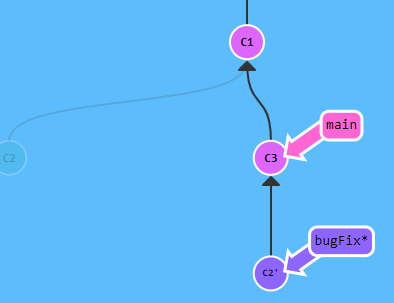
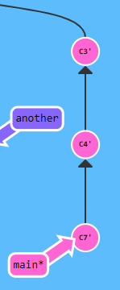

git branch <new 分支名称>	在当前(指针)位置创建新分支

git branch bugWork main~^2~1	从main向前直至分支,选择第二分支,命名该分支为`bugWork`


git branch -f <bugFix> <bugFix^> 把bugFix分支移至 bugFix的第一父分支,后者默认参数为当前位置

git log	查看提交记录的哈希值(基于 SHA-1，共 40 ),使用时输入前几个也可以定位

git checkout  <分支名称/提交记录哈希值> 	**切换**分支或提交记录(通过提交记录哈希值)

git checkout bugFix^^ 	切换至bugFix的第二个父结点(与^个数相同)

git checkout bugFix~n	切换至bugFix的第n个父结点

git checkout <-b> <分支名称> 	创建一个新的分支同时切换到新创建的分支(之前的分支不会被commit)

git merge <另一分支名称> 将当前分支与另一分支**合并**,bugFix的commit会到c4处

效果如下


注意,此时c4^指向c3而不是c2,即指针当初在c3上执行合并则父节点为c3


git rebase 	<a>  <b>将< a>与< b>**合并**,会在< a>后面生成新提交,

git rebase 	<a>		将当前分支与< a>**合并**,会在< a>后面生成新提交

加上 -i参数可以使用类图形化窗口操作合并顺序和分支

效果如下(与git merge对比)



git reset local^			在reset后，所做的变更还在，但是处于未加入暂存区状态。

git reset的本质是：移动HEAD以及它所指向的branch三种不同的参数（–hard \soft\mixed）：影响的是**工作区**和**缓存区**清空与保留


| 参数            | 功能                                                 | 场景                                                   |
| --------------- | ---------------------------------------------------- | ------------------------------------------------------ |
| --hard          | 清空工作区与缓存区                                   | 放弃目标版本后所有的修改                               |
| --soft          | 保留工作区与缓存区，但是把版本之间的差异存放在缓存区 | 合并多个commit                                         |
| --mixed(或缺省) | 保留工作区清空缓存区，把版本之间的差异存放在工作区   | 1、有错误的commit需要修改；2、git reset HEAD清空缓存区 |

```
$ git reset --hard HEAD	#恢复当前版本，删除工作区和缓存区的修改
$ git reset --soft HEAD^	#恢复上一个版本，保留工作区，缓存区准备再次提交commit
$ git reset --mixed HEAD	#恢复当前版本，保留工作区，清空缓存区
$ git reset --hard 1094a	#切换到特定版本号，并删除工作区和缓存区的修改

#场景1：修改仅存在工作区
$ git checkout -- readme.txt # 单文件
#场景2：修改存在暂存区、工作区
$ git reset HEAD readme.txt
$ git checkout -- readme.txt
#场景3：修改存在版本库、暂存区、工作区
$ git reset --hard 1094a
```


git revert pushed^	  撤销更改并**分享**给别人

revert新提交记录 `C2'` 引入了**更改** —— 这些更改刚好是用来撤销 `C2` 这个提交的(即新提交撤销上n个提交)

revert执行后会产生新的commit记录，**是通过一次新的commit来恢复到之前旧的commit**，但revert会保留恢复的该次提交后面的其它提交内容，假如后面的提交与要恢复的提交更改了同一地方，此时用revert就会产生冲突!

我们执行`git revert t1`，这么做其实结果是要撤销t1的提交，注意，仅仅是撤销t1的提交，把t1的修改恢复到t1之前也就是初始的状态，而不会影响t2，t3的提交。但**如果t2，t3中修改了t1修改的同一地方，那么就会产生冲突，因为revert意图撤销t1的修改，但发现t2和t3把t1的修改再次修改了**，此时，revert意图变得不清晰，因为它无法确定到底是应用你最新的修改，还是恢复到初始状态


git cherry-pick <提交号>	可以是一串连续的提交号

例子:移动分支前


使用`git cherry-pick c3 c4 c7`提交后:



这样子移动分支可以使得分支简洁(debug的过程可以省去)


git tag <锚点名> <节点名/节点哈希值> 	使得存在一个永久存在的关键名称,节点名默认值为当前指针位置


`git describe <ref>`

`<ref>` 可以是任何能被 Git 识别成提交记录的引用，如果你没有指定的话，Git 会以你目前所检出的位置（`HEAD`）。


它输出的结果是这样的：

 < tag>_< numCommits>_g< hash>

`tag` 表示的是离 `ref` **最近的标签**， `numCommits` 是表示这个 `ref` 与 `tag` 相差有多少个提交记录， `hash` 表示的是**你所给定的** `ref` 所表示的提交记录**哈希值**的前几位。

`ref` **提交记录上有**某个标签时，则只**输出标签名称**


单独的^指父节点,~^n指向前面有分支合并的第n分支,

~^n~k指向前面有分支合并的第n分支的第k父节点